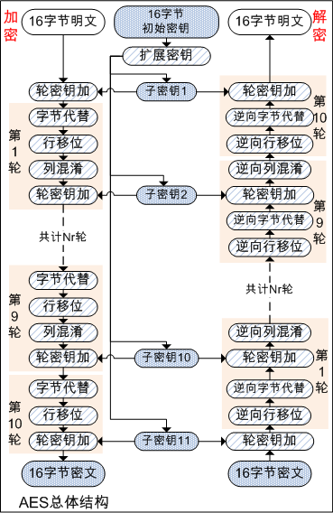
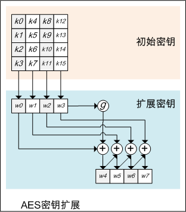
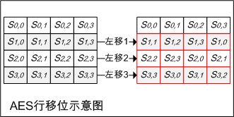
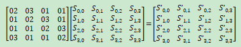
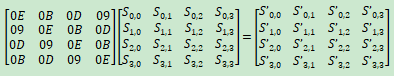

# AES加密算法原理及其GO语言实现

AES是作为DES的替代标准出现的，全称Advanced Encryption Standard，即：高级加密标准。
AES加密算法，经历了公开的选拔，最终2000年，由比利时密码学家Joan Daemen和Vincent Rijmen设计的Rijndael算法被选中，成为了AES标准。

AES明文分组长度为128位，即16个字节，密钥长度可以为16个字节、24个字节、或32个字节，即128位密钥、192位密钥、或256位密钥。

## 总体结构

和DES相同，AES也由多个轮组成，其中每个轮分为SubBytes、ShiftRows、MixColumns、AddRoundKey 4个步骤，即：字节代替、行移位、列混淆和轮密钥加。
根据密钥长度不同，所需轮数也不同，128位、192位、256位密钥，分别需要10轮、12轮和14轮。
第1轮之前有一次AddRoundKey，即轮密钥加，可以视为第0轮；之后1至N-1轮，执行SubBytes、ShiftRows、MixColumns、AddRoundKey；最后一轮仅包括：SubBytes、MixColumns、AddRoundKey。

用Nr表示轮数，需要Nr+1次轮密钥加，因此需要Nr+1个子密钥。以128位密钥为例，需要11个子密钥，因此需要密钥扩展，密钥扩展方法下文介绍。
AES中没有使用Feistel网络，其结构称为SPN结构。

AES的解密算法，即加密算法的反向操作。

如下为AES总体结构示意图：



## 密钥扩展

Nk表示初始密钥的字数，一个字为4个字节，以16字节初始密钥为例，初始密钥共计4个字。
AES加密过程共计需Nk+7个子密钥，即4(Nk + 7)个字，以16字节初始密钥为例，共计需11个子密钥，44个字。
其中前Nk个字作为种子密钥，由初始密钥填充。以16字节初始密钥为例，前4个字，由初始密钥填充。
之后的每个字，W[i]等于前边一个字W[i-1]与Nk个字之前的字W[i-Nk]异或。
但是对于Nk整数倍位置的字，在异或之前先对W[i-1]做如下变换：字节循环移位、S盒变换，并异或轮常数。

如下为密钥扩展示意图：



go标准库AES密钥扩展实现如下：

```go
func expandKeyGo(key []byte, enc, dec []uint32) {
	var i int
	nk := len(key) / 4
	for i = 0; i < nk; i++ {
		//其中前Nk个字作为种子密钥，由初始密钥填充
		//以16字节初始密钥为例，前4个字，由初始密钥填充
		enc[i] = uint32(key[4*i])<<24 | uint32(key[4*i+1])<<16 | uint32(key[4*i+2])<<8 | uint32(key[4*i+3])
	}
	for ; i < len(enc); i++ {
		t := enc[i-1]
		if i%nk == 0 {
			//但是对于Nk整数倍位置的字，在异或之前先对W[i-1]做如下变换：字节循环移位、S盒变换，并异或轮常数
			t = subw(rotw(t)) ^ (uint32(powx[i/nk-1]) << 24)
		} else if nk > 6 && i%nk == 4 {
			t = subw(t)
		}
		//之后的每个字，W[i]等于前边一个字W[i-1]与Nk个字之前的字W[i-Nk]异或
		enc[i] = enc[i-nk] ^ t
	}

	//enc为加密子密钥组
	//dec为解密子密钥组，dec为enc逆序
	if dec == nil {
		return
	}
	n := len(enc)
	for i := 0; i < n; i += 4 {
		ei := n - i - 4
		for j := 0; j < 4; j++ {
			x := enc[ei+j]
			if i > 0 && i+4 < n {
				x = td0[sbox0[x>>24]] ^ td1[sbox0[x>>16&0xff]] ^ td2[sbox0[x>>8&0xff]] ^ td3[sbox0[x&0xff]]
			}
			dec[i+j] = x
		}
	}
}
//代码位置src/crypto/aes/block.go
```

如下将展开介绍每轮中的4个步骤：字节代替、行移位、列混淆和轮密钥加。

## 字节代替SubBytes

AES定义了一个S盒，它由16x16个字节组成的矩阵，包含了8位所能表示的256个数的一个置换表。
AES的分组长度128位，即16字节，每个字节高4位作为行值、低4位作为列值，从S盒中查找指定行、列的值作为输出。
AES输入的16个字节，每个字节按上述方式映射为新的字节，即字节代替。

如下为go标准库中使用的S盒和逆S盒：

```go
//S盒
var sbox0 = [256]byte{
	0x63, 0x7c, 0x77, 0x7b, 0xf2, 0x6b, 0x6f, 0xc5, 0x30, 0x01, 0x67, 0x2b, 0xfe, 0xd7, 0xab, 0x76,
	0xca, 0x82, 0xc9, 0x7d, 0xfa, 0x59, 0x47, 0xf0, 0xad, 0xd4, 0xa2, 0xaf, 0x9c, 0xa4, 0x72, 0xc0,
	0xb7, 0xfd, 0x93, 0x26, 0x36, 0x3f, 0xf7, 0xcc, 0x34, 0xa5, 0xe5, 0xf1, 0x71, 0xd8, 0x31, 0x15,
	0x04, 0xc7, 0x23, 0xc3, 0x18, 0x96, 0x05, 0x9a, 0x07, 0x12, 0x80, 0xe2, 0xeb, 0x27, 0xb2, 0x75,
	0x09, 0x83, 0x2c, 0x1a, 0x1b, 0x6e, 0x5a, 0xa0, 0x52, 0x3b, 0xd6, 0xb3, 0x29, 0xe3, 0x2f, 0x84,
	0x53, 0xd1, 0x00, 0xed, 0x20, 0xfc, 0xb1, 0x5b, 0x6a, 0xcb, 0xbe, 0x39, 0x4a, 0x4c, 0x58, 0xcf,
	0xd0, 0xef, 0xaa, 0xfb, 0x43, 0x4d, 0x33, 0x85, 0x45, 0xf9, 0x02, 0x7f, 0x50, 0x3c, 0x9f, 0xa8,
	0x51, 0xa3, 0x40, 0x8f, 0x92, 0x9d, 0x38, 0xf5, 0xbc, 0xb6, 0xda, 0x21, 0x10, 0xff, 0xf3, 0xd2,
	0xcd, 0x0c, 0x13, 0xec, 0x5f, 0x97, 0x44, 0x17, 0xc4, 0xa7, 0x7e, 0x3d, 0x64, 0x5d, 0x19, 0x73,
	0x60, 0x81, 0x4f, 0xdc, 0x22, 0x2a, 0x90, 0x88, 0x46, 0xee, 0xb8, 0x14, 0xde, 0x5e, 0x0b, 0xdb,
	0xe0, 0x32, 0x3a, 0x0a, 0x49, 0x06, 0x24, 0x5c, 0xc2, 0xd3, 0xac, 0x62, 0x91, 0x95, 0xe4, 0x79,
	0xe7, 0xc8, 0x37, 0x6d, 0x8d, 0xd5, 0x4e, 0xa9, 0x6c, 0x56, 0xf4, 0xea, 0x65, 0x7a, 0xae, 0x08,
	0xba, 0x78, 0x25, 0x2e, 0x1c, 0xa6, 0xb4, 0xc6, 0xe8, 0xdd, 0x74, 0x1f, 0x4b, 0xbd, 0x8b, 0x8a,
	0x70, 0x3e, 0xb5, 0x66, 0x48, 0x03, 0xf6, 0x0e, 0x61, 0x35, 0x57, 0xb9, 0x86, 0xc1, 0x1d, 0x9e,
	0xe1, 0xf8, 0x98, 0x11, 0x69, 0xd9, 0x8e, 0x94, 0x9b, 0x1e, 0x87, 0xe9, 0xce, 0x55, 0x28, 0xdf,
	0x8c, 0xa1, 0x89, 0x0d, 0xbf, 0xe6, 0x42, 0x68, 0x41, 0x99, 0x2d, 0x0f, 0xb0, 0x54, 0xbb, 0x16,
}

//逆S盒
var sbox1 = [256]byte{
	0x52, 0x09, 0x6a, 0xd5, 0x30, 0x36, 0xa5, 0x38, 0xbf, 0x40, 0xa3, 0x9e, 0x81, 0xf3, 0xd7, 0xfb,
	0x7c, 0xe3, 0x39, 0x82, 0x9b, 0x2f, 0xff, 0x87, 0x34, 0x8e, 0x43, 0x44, 0xc4, 0xde, 0xe9, 0xcb,
	0x54, 0x7b, 0x94, 0x32, 0xa6, 0xc2, 0x23, 0x3d, 0xee, 0x4c, 0x95, 0x0b, 0x42, 0xfa, 0xc3, 0x4e,
	0x08, 0x2e, 0xa1, 0x66, 0x28, 0xd9, 0x24, 0xb2, 0x76, 0x5b, 0xa2, 0x49, 0x6d, 0x8b, 0xd1, 0x25,
	0x72, 0xf8, 0xf6, 0x64, 0x86, 0x68, 0x98, 0x16, 0xd4, 0xa4, 0x5c, 0xcc, 0x5d, 0x65, 0xb6, 0x92,
	0x6c, 0x70, 0x48, 0x50, 0xfd, 0xed, 0xb9, 0xda, 0x5e, 0x15, 0x46, 0x57, 0xa7, 0x8d, 0x9d, 0x84,
	0x90, 0xd8, 0xab, 0x00, 0x8c, 0xbc, 0xd3, 0x0a, 0xf7, 0xe4, 0x58, 0x05, 0xb8, 0xb3, 0x45, 0x06,
	0xd0, 0x2c, 0x1e, 0x8f, 0xca, 0x3f, 0x0f, 0x02, 0xc1, 0xaf, 0xbd, 0x03, 0x01, 0x13, 0x8a, 0x6b,
	0x3a, 0x91, 0x11, 0x41, 0x4f, 0x67, 0xdc, 0xea, 0x97, 0xf2, 0xcf, 0xce, 0xf0, 0xb4, 0xe6, 0x73,
	0x96, 0xac, 0x74, 0x22, 0xe7, 0xad, 0x35, 0x85, 0xe2, 0xf9, 0x37, 0xe8, 0x1c, 0x75, 0xdf, 0x6e,
	0x47, 0xf1, 0x1a, 0x71, 0x1d, 0x29, 0xc5, 0x89, 0x6f, 0xb7, 0x62, 0x0e, 0xaa, 0x18, 0xbe, 0x1b,
	0xfc, 0x56, 0x3e, 0x4b, 0xc6, 0xd2, 0x79, 0x20, 0x9a, 0xdb, 0xc0, 0xfe, 0x78, 0xcd, 0x5a, 0xf4,
	0x1f, 0xdd, 0xa8, 0x33, 0x88, 0x07, 0xc7, 0x31, 0xb1, 0x12, 0x10, 0x59, 0x27, 0x80, 0xec, 0x5f,
	0x60, 0x51, 0x7f, 0xa9, 0x19, 0xb5, 0x4a, 0x0d, 0x2d, 0xe5, 0x7a, 0x9f, 0x93, 0xc9, 0x9c, 0xef,
	0xa0, 0xe0, 0x3b, 0x4d, 0xae, 0x2a, 0xf5, 0xb0, 0xc8, 0xeb, 0xbb, 0x3c, 0x83, 0x53, 0x99, 0x61,
	0x17, 0x2b, 0x04, 0x7e, 0xba, 0x77, 0xd6, 0x26, 0xe1, 0x69, 0x14, 0x63, 0x55, 0x21, 0x0c, 0x7d,
}
//代码位置src/crypto/aes/const.go
```

## 行移位ShiftRows

AES输入的16个字节组成4x4字节矩阵，行移位即：
第1行保持不变，第2行循环左移1个字节，第3行循环左移2个字节，第4行循环左移3个字节。
逆向行移位为后3行做行移位的反向操作，如第2行循环右移1个字节，其他行类似处理。

附行移位示意图如下：



## 列混淆MixColumns

列混淆和逆向列混淆，实际上是使用乘法矩阵，但是其加法和乘法均为定义在有限域上的加法和乘法。

如下为正向列混淆：



如下为逆向列混淆：



## 轮密钥加AddRoundKey

轮密钥加，即128位输入与128位轮密钥做异或运算。

## go标准库中AES加密算法实现

go标准库中AES算法加密、解密实现代码如下：

```go
func newCipherGeneric(key []byte) (cipher.Block, error) {
	n := len(key) + 28
	c := aesCipher{make([]uint32, n), make([]uint32, n)}
	//密钥扩展
	expandKeyGo(key, c.enc, c.dec)
	return &c, nil
}

//加密
//xk即子密钥组
func encryptBlockGo(xk []uint32, dst, src []byte) {
	var s0, s1, s2, s3, t0, t1, t2, t3 uint32

	//按4x4矩阵排列
	s0 = uint32(src[0])<<24 | uint32(src[1])<<16 | uint32(src[2])<<8 | uint32(src[3])
	s1 = uint32(src[4])<<24 | uint32(src[5])<<16 | uint32(src[6])<<8 | uint32(src[7])
	s2 = uint32(src[8])<<24 | uint32(src[9])<<16 | uint32(src[10])<<8 | uint32(src[11])
	s3 = uint32(src[12])<<24 | uint32(src[13])<<16 | uint32(src[14])<<8 | uint32(src[15])

	//第1次轮密钥加
	s0 ^= xk[0]
	s1 ^= xk[1]
	s2 ^= xk[2]
	s3 ^= xk[3]

	//nr为中间重复轮数
	//例如128位密钥，44字子密钥，此处为9轮
	//-2位去除开头和结尾轮
	nr := len(xk)/4 - 2
	//4表示已使用了4个字子密钥
	k := 4
	for r := 0; r < nr; r++ {
		//此处代码包括字节代替、行移位、列混淆、轮密钥加
		t0 = xk[k+0] ^ te0[uint8(s0>>24)] ^ te1[uint8(s1>>16)] ^ te2[uint8(s2>>8)] ^ te3[uint8(s3)]
		t1 = xk[k+1] ^ te0[uint8(s1>>24)] ^ te1[uint8(s2>>16)] ^ te2[uint8(s3>>8)] ^ te3[uint8(s0)]
		t2 = xk[k+2] ^ te0[uint8(s2>>24)] ^ te1[uint8(s3>>16)] ^ te2[uint8(s0>>8)] ^ te3[uint8(s1)]
		t3 = xk[k+3] ^ te0[uint8(s3>>24)] ^ te1[uint8(s0>>16)] ^ te2[uint8(s1>>8)] ^ te3[uint8(s2)]
		k += 4
		s0, s1, s2, s3 = t0, t1, t2, t3
	}

	//最后一轮仅包括字节代替、行移位、轮密钥加
	//此处为字节代替和行移位
	s0 = uint32(sbox0[t0>>24])<<24 | uint32(sbox0[t1>>16&0xff])<<16 | uint32(sbox0[t2>>8&0xff])<<8 | uint32(sbox0[t3&0xff])
	s1 = uint32(sbox0[t1>>24])<<24 | uint32(sbox0[t2>>16&0xff])<<16 | uint32(sbox0[t3>>8&0xff])<<8 | uint32(sbox0[t0&0xff])
	s2 = uint32(sbox0[t2>>24])<<24 | uint32(sbox0[t3>>16&0xff])<<16 | uint32(sbox0[t0>>8&0xff])<<8 | uint32(sbox0[t1&0xff])
	s3 = uint32(sbox0[t3>>24])<<24 | uint32(sbox0[t0>>16&0xff])<<16 | uint32(sbox0[t1>>8&0xff])<<8 | uint32(sbox0[t2&0xff])

	//轮密钥加
	s0 ^= xk[k+0]
	s1 ^= xk[k+1]
	s2 ^= xk[k+2]
	s3 ^= xk[k+3]

	//输出
	dst[0], dst[1], dst[2], dst[3] = byte(s0>>24), byte(s0>>16), byte(s0>>8), byte(s0)
	dst[4], dst[5], dst[6], dst[7] = byte(s1>>24), byte(s1>>16), byte(s1>>8), byte(s1)
	dst[8], dst[9], dst[10], dst[11] = byte(s2>>24), byte(s2>>16), byte(s2>>8), byte(s2)
	dst[12], dst[13], dst[14], dst[15] = byte(s3>>24), byte(s3>>16), byte(s3>>8), byte(s3)
}

//解密
//xk即子密钥组
func decryptBlockGo(xk []uint32, dst, src []byte) {
	var s0, s1, s2, s3, t0, t1, t2, t3 uint32

	//按4x4矩阵排列
	s0 = uint32(src[0])<<24 | uint32(src[1])<<16 | uint32(src[2])<<8 | uint32(src[3])
	s1 = uint32(src[4])<<24 | uint32(src[5])<<16 | uint32(src[6])<<8 | uint32(src[7])
	s2 = uint32(src[8])<<24 | uint32(src[9])<<16 | uint32(src[10])<<8 | uint32(src[11])
	s3 = uint32(src[12])<<24 | uint32(src[13])<<16 | uint32(src[14])<<8 | uint32(src[15])

	//第1次轮密钥加
	s0 ^= xk[0]
	s1 ^= xk[1]
	s2 ^= xk[2]
	s3 ^= xk[3]

	//nr为中间重复轮数
	//例如128位密钥，44字子密钥，此处为9轮
	//-2位去除开头和结尾轮
	nr := len(xk)/4 - 2
	//4表示已使用了4个字子密钥
	k := 4
	for r := 0; r < nr; r++ {
		//此处代码包括逆向字节代替、逆向行移位、逆向列混淆、轮密钥加
		t0 = xk[k+0] ^ td0[uint8(s0>>24)] ^ td1[uint8(s3>>16)] ^ td2[uint8(s2>>8)] ^ td3[uint8(s1)]
		t1 = xk[k+1] ^ td0[uint8(s1>>24)] ^ td1[uint8(s0>>16)] ^ td2[uint8(s3>>8)] ^ td3[uint8(s2)]
		t2 = xk[k+2] ^ td0[uint8(s2>>24)] ^ td1[uint8(s1>>16)] ^ td2[uint8(s0>>8)] ^ td3[uint8(s3)]
		t3 = xk[k+3] ^ td0[uint8(s3>>24)] ^ td1[uint8(s2>>16)] ^ td2[uint8(s1>>8)] ^ td3[uint8(s0)]
		k += 4
		s0, s1, s2, s3 = t0, t1, t2, t3
	}

	//最后一轮仅包括逆向字节代替、逆向行移位、轮密钥加
	//此处为逆向字节代替和逆向行移位
	s0 = uint32(sbox1[t0>>24])<<24 | uint32(sbox1[t3>>16&0xff])<<16 | uint32(sbox1[t2>>8&0xff])<<8 | uint32(sbox1[t1&0xff])
	s1 = uint32(sbox1[t1>>24])<<24 | uint32(sbox1[t0>>16&0xff])<<16 | uint32(sbox1[t3>>8&0xff])<<8 | uint32(sbox1[t2&0xff])
	s2 = uint32(sbox1[t2>>24])<<24 | uint32(sbox1[t1>>16&0xff])<<16 | uint32(sbox1[t0>>8&0xff])<<8 | uint32(sbox1[t3&0xff])
	s3 = uint32(sbox1[t3>>24])<<24 | uint32(sbox1[t2>>16&0xff])<<16 | uint32(sbox1[t1>>8&0xff])<<8 | uint32(sbox1[t0&0xff])

	//轮密钥加
	s0 ^= xk[k+0]
	s1 ^= xk[k+1]
	s2 ^= xk[k+2]
	s3 ^= xk[k+3]

	//输出
	dst[0], dst[1], dst[2], dst[3] = byte(s0>>24), byte(s0>>16), byte(s0>>8), byte(s0)
	dst[4], dst[5], dst[6], dst[7] = byte(s1>>24), byte(s1>>16), byte(s1>>8), byte(s1)
	dst[8], dst[9], dst[10], dst[11] = byte(s2>>24), byte(s2>>16), byte(s2>>8), byte(s2)
	dst[12], dst[13], dst[14], dst[15] = byte(s3>>24), byte(s3>>16), byte(s3>>8), byte(s3)
}
//代码位置src/crypto/aes/block.go
```

## 后记

AES算法目前还是足够安全的。
待续。