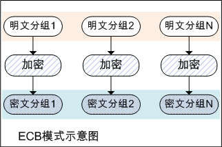
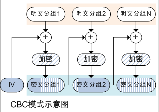
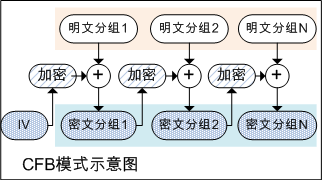
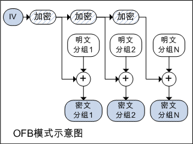
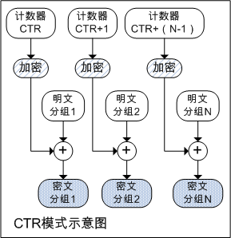

# 对称加密算法的分组模式及其Go语言实现

之前介绍的DES、3DES、AES加密算法，只能加密固定长度的明文。如果需要加密任意长度的明文，需要对明文分组加密。
DES、3DES、AES等又称分组密码，而分组有很多模式，如：ECB模式、CBC模式、CFB模式、OFB模式、CTR模式，如下将逐一介绍。

## ECB模式

ECB模式，全称Electronic Codebook模式，译为电子密码本模式，即用相同的密码分别对明文分组独立加密。
ECB模式是最简单的模式，因为相同的明文分组会加密为相同的密文分组，因此存在一定风险。

如下为ECB模式示意图：



另外当最后一个明文分组的内容，小于分组长度时，需要用特定的数据进行填充。

## CBC模式

CBC模式，全称Cipher Block Chaining模式，译为密文分组链接模式，即加密算法的输入是上一个密文分组和下一个明文分组的异或。
因为是将上一个密文分组和下一个明文分组的内容混合加密，因此可以避免ECB模式的缺陷。
当加密第一个明文分组时，由于不存在上一个密文分组，因此需要准备与分组等长的初始化向量IV，来代替上一个密文分组。

如下为CBC模式示意图：



go标准库中CBC模式代码如下：

```go
type cbc struct {
	//b为加密算法，如DES、AES
	b         Block
	//加密算法支持的明文分组长度
	blockSize int
	//初始化向量IV
	iv        []byte
	//临时变量
	tmp       []byte
}

type cbcEncrypter cbc

//指定加密算法和IV
func NewCBCEncrypter(b Block, iv []byte) BlockMode {
	if len(iv) != b.BlockSize() {
		panic("cipher.NewCBCEncrypter: IV length must equal block size")
	}
	if cbc, ok := b.(cbcEncAble); ok {
		return cbc.NewCBCEncrypter(iv)
	}
	return (*cbcEncrypter)(newCBC(b, iv))
}

//加密
func (x *cbcEncrypter) CryptBlocks(dst, src []byte) {
	if len(src)%x.blockSize != 0 {
		panic("crypto/cipher: input not full blocks")
	}
	if len(dst) < len(src) {
		panic("crypto/cipher: output smaller than input")
	}

	iv := x.iv

	for len(src) > 0 {
		//上一个密文分组和下一个明文分组的异或
		//当加密第一个明文分组时，使用初始化向量IV
		xorBytes(dst[:x.blockSize], src[:x.blockSize], iv)
		//执行加密算法
		x.b.Encrypt(dst[:x.blockSize], dst[:x.blockSize])

		iv = dst[:x.blockSize]
		src = src[x.blockSize:]
		dst = dst[x.blockSize:]
	}

	copy(x.iv, iv)
}
//代码位置src/crypto/cipher/cbc.go
```

## CFB模式

CFB模式，全称Cipher FeedBack模式，译为密文反馈模式，即上一个密文分组作为加密算法的输入，输出与明文异或作为下一个分组的密文。
在CFB模式中，明文分组和密文分组之间只有一次异或。

如下为CFB模式示意图：



CFB模式与一次性密码本相似，都是通过将明文与随机比特序列进行异或运算来生成密文。
但由于CFB模式中密码算法的输出是通过计算得到的，并非真正的随机数，因此不具备一次性密码本那样理论上不可破译的性质。
CFB模式可以看做使用分组方式实现流密码的方式。

go标准库中CFB模式代码如下：

```go
type cfb struct {
	//加密算法
	b       Block
	//加密的输入
	next    []byte
	//加密的输出
	out     []byte
	outUsed int

	decrypt bool
}

//加密或解密
//decrypt为true表示解密
func (x *cfb) XORKeyStream(dst, src []byte) {
	for len(src) > 0 {
		if x.outUsed == len(x.out) {
			x.b.Encrypt(x.out, x.next)
			x.outUsed = 0
		}

		if x.decrypt {
			copy(x.next[x.outUsed:], src)
		}
		//加密输出与明文异或作为下一个分组的密文
		n := xorBytes(dst, src, x.out[x.outUsed:])
		if !x.decrypt {
			//上一个密文分组作为加密算法的输入
			copy(x.next[x.outUsed:], dst)
		}
		dst = dst[n:]
		src = src[n:]
		x.outUsed += n
	}
}

//加密器
func NewCFBEncrypter(block Block, iv []byte) Stream {
	return newCFB(block, iv, false)
}

//解密器
func NewCFBDecrypter(block Block, iv []byte) Stream {
	return newCFB(block, iv, true)
}

func newCFB(block Block, iv []byte, decrypt bool) Stream {
	//分组长度
	blockSize := block.BlockSize()
	if len(iv) != blockSize {
		//初始化向量要求与分组长度等长
		panic("cipher.newCFB: IV length must equal block size")
	}
	x := &cfb{
		b:       block,
		out:     make([]byte, blockSize),
		next:    make([]byte, blockSize),
		outUsed: blockSize,
		decrypt: decrypt,
	}
	//加密的输入
	copy(x.next, iv)

	return x
}
//代码位置src/crypto/cipher/cfb.go
```

## OFB模式

OFB模式，全称Output Feedback模式，译为输出反馈模式。
OFB模式与CFB模式类似，只是加密算法的输入时上一次加密的输出。
在OFB模式中，异或所需的密钥流，可以实现通过密码算法生成，即生成密钥流的操作可以与异或运算并行。

OFB模式加密和处理解密逻辑相同，明文与密钥流异或生成密文，密文与密钥流异或生成明文。

如下为OFB模式示意图：



go标准库中OFB模式代码如下：

```go
type ofb struct {
	//加密算法
	b       Block
	//加密的输入
	cipher  []byte
	out     []byte
	outUsed int
}

func NewOFB(b Block, iv []byte) Stream {
	//分组长度
	blockSize := b.BlockSize()
	if len(iv) != blockSize {
		return nil
	}
	//const streamBufferSize = 512
	bufSize := streamBufferSize
	if bufSize < blockSize {
		bufSize = blockSize
	}
	x := &ofb{
		b:       b,
		cipher:  make([]byte, blockSize),
		out:     make([]byte, 0, bufSize),
		outUsed: 0,
	}

	//加密的输入
	copy(x.cipher, iv)
	return x
}

//生成密钥流
func (x *ofb) refill() {
	bs := x.b.BlockSize()
	remain := len(x.out) - x.outUsed
	if remain > x.outUsed {
		return
	}
	copy(x.out, x.out[x.outUsed:])
	x.out = x.out[:cap(x.out)]
	for remain < len(x.out)-bs {
		x.b.Encrypt(x.cipher, x.cipher)
		copy(x.out[remain:], x.cipher)
		remain += bs
	}
	x.out = x.out[:remain]
	x.outUsed = 0
}

func (x *ofb) XORKeyStream(dst, src []byte) {
	for len(src) > 0 {
		if x.outUsed >= len(x.out)-x.b.BlockSize() {
			//生成密钥流
			x.refill()
		}
		//与密钥流异或运算
		n := xorBytes(dst, src, x.out[x.outUsed:])
		dst = dst[n:]
		src = src[n:]
		x.outUsed += n
	}
}
//代码位置src/crypto/cipher/ofb.go
```

## CTR模式

CTR模式，全称Counter模式，译为计数器模式。
CTR模式中，每个分组对应一个逐次累加的计数器，并通过对计数器进行加密来生成密钥流。
也即最终的密文分组是通过将计数器加密得到的比特序列，与明文分组进行异或运算得到的。

如下为CTR模式示意图：



go标准库中CTR模式代码如下：

```go
type ctr struct {
	//加密算法
	b       Block
	//加密的输入
	ctr     []byte
	out     []byte
	outUsed int
}

const streamBufferSize = 512

type ctrAble interface {
	NewCTR(iv []byte) Stream
}

func NewCTR(block Block, iv []byte) Stream {
	if ctr, ok := block.(ctrAble); ok {
		return ctr.NewCTR(iv)
	}
	if len(iv) != block.BlockSize() {
		panic("cipher.NewCTR: IV length must equal block size")
	}
	bufSize := streamBufferSize
	if bufSize < block.BlockSize() {
		bufSize = block.BlockSize()
	}
	return &ctr{
		b:       block,
		ctr:     dup(iv),
		out:     make([]byte, 0, bufSize),
		outUsed: 0,
	}
}

//生成密钥流
func (x *ctr) refill() {
	remain := len(x.out) - x.outUsed
	copy(x.out, x.out[x.outUsed:])
	x.out = x.out[:cap(x.out)]
	bs := x.b.BlockSize()
	for remain <= len(x.out)-bs {
		x.b.Encrypt(x.out[remain:], x.ctr)
		remain += bs

		//计数器递增
		for i := len(x.ctr) - 1; i >= 0; i-- {
			x.ctr[i]++
			if x.ctr[i] != 0 {
				break
			}
		}
	}
	x.out = x.out[:remain]
	x.outUsed = 0
}

func (x *ctr) XORKeyStream(dst, src []byte) {
	for len(src) > 0 {
		if x.outUsed >= len(x.out)-x.b.BlockSize() {
			//生成密钥流
			x.refill()
		}
		//与密钥流异或运算
		n := xorBytes(dst, src, x.out[x.outUsed:])
		dst = dst[n:]
		src = src[n:]
		x.outUsed += n
	}
}
```

Fabric中实现CBC模式的AES加密

代码如下：

```go
//AES加密、CBC模式、PKCS7填充算法
func AESCBCPKCS7Encrypt(key, src []byte) ([]byte, error) {
	//PKCS7填充算法
	tmp := pkcs7Padding(src)
	//AES加密、CBC模式
	return aesCBCEncrypt(key, tmp)
}

//PKCS7填充算法
//PKCS7即填充字符串由一个字节序列组成，每个字节填充该字节序列的长度
func pkcs7Padding(src []byte) []byte {
	padding := aes.BlockSize - len(src)%aes.BlockSize
	padtext := bytes.Repeat([]byte{byte(padding)}, padding)
	return append(src, padtext...)
}

//AES加密、CBC模式
func aesCBCEncrypt(key, s []byte) ([]byte, error) {
	if len(s)%aes.BlockSize != 0 {
		return nil, errors.New("Invalid plaintext. It must be a multiple of the block size")
	}

	block, err := aes.NewCipher(key)
	if err != nil {
		return nil, err
	}

	ciphertext := make([]byte, aes.BlockSize+len(s))
	//初始向量IV
	iv := ciphertext[:aes.BlockSize]
	if _, err := io.ReadFull(rand.Reader, iv); err != nil {
		return nil, err
	}

	mode := cipher.NewCBCEncrypter(block, iv)
	mode.CryptBlocks(ciphertext[aes.BlockSize:], s)

	return ciphertext, nil
}
//代码位置github.com/hyperledger/fabric/bccsp/sw/aes.go
```

后记

ECB模式因其高风险，不应再使用。
CBC模式、CFB模式、OFB模式、CTR模式，均可使用。
其中Fabric中使用了CBC模式。
待续。


