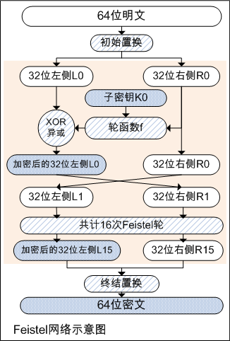
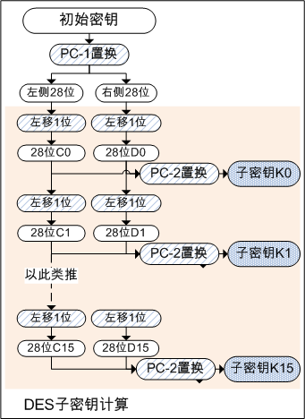
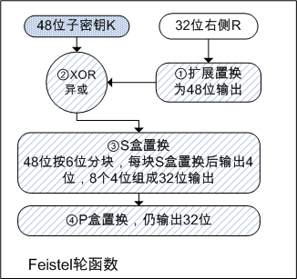
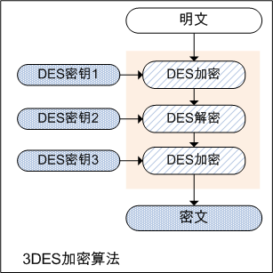
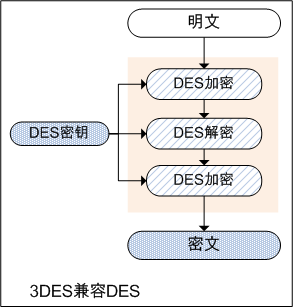

# DES、3DES加密算法原理及其GO语言实现

DES加密算法，为对称加密算法中的一种。70年代初由IBM研发，后1977年被美国国家标准局采纳为数据加密标准，即DES全称的由来：Data Encryption Standard。
对称加密算法，是相对于非对称加密算法而言的。两者区别在于，对称加密在加密和解密时使用同一密钥，而非对称加密在加密和解密时使用不同的密钥，即公钥和私钥。
常见的DES、3DES、AES均为对称加密算法，而RSA、椭圆曲线加密算法，均为非对称加密算法。

DES是以64比特的明文为一个单位来进行加密的，超过64比特的数据，要求按固定的64比特的大小分组，分组有很多模式，后续单独总结，暂时先介绍DES加密算法。
DES使用的密钥长度为64比特，但由于每隔7个比特设置一个奇偶校验位，因此其密钥长度实际为56比特。奇偶校验为最简单的错误检测码，即根据一组二进制代码中1的个数是奇数或偶数来检测错误。

## Feistel网络

DES的基本结构，由IBM公司的Horst Feistel设计，因此称Feistel网络。
在Feistel网络中，加密的每个步骤称为轮，经过初始置换后的64位明文，进行了16轮Feistel轮的加密过程，最后经过终结置换后形成最终的64位密文。
如下为Feistel网络的示意图：



64比特明文被分为左、右两部分处理，右侧数据和子密钥经过轮函数f生成用于加密左侧数据的比特序列，与左侧数据异或运算，运算结果输出为加密后的左侧，右侧数据则直接输出为右侧。
其中子密钥为本轮加密使用的密钥，每次Feistel均使用不同的子密钥。子密钥的计算，以及轮函数的细节，稍后下文介绍。
由于一次Feistel轮并不会加密右侧，因此需要将上一轮输出后的左右两侧对调后，重复Feistel轮的过程，DES算法共计进行16次Feistel轮，最后一轮输出后左右两侧无需对调。

DES加密和解密的过程一致，均使用Feistel网络实现，区别仅在于解密时，密文作为输入，并逆序使用子密钥。

go标准库中DES算法实现如下：

```go
func cryptBlock(subkeys []uint64, dst, src []byte, decrypt bool) {
	b := binary.BigEndian.Uint64(src)
	//初始置换
	b = permuteInitialBlock(b)
	left, right := uint32(b>>32), uint32(b)

	var subkey uint64
	//共计16次feistel轮
	for i := 0; i < 16; i++ {
		//加密和解密使用子密钥顺序相反
		if decrypt {
			subkey = subkeys[15-i]
		} else {
			subkey = subkeys[i]
		}
		//feistel轮函数
		left, right = right, left^feistel(right, subkey)
	}
	//最后一轮无需对调
	preOutput := (uint64(right) << 32) | uint64(left)
	//终结置换
	binary.BigEndian.PutUint64(dst, permuteFinalBlock(preOutput))
}
//代码位置src/crypto/des/block.go
```

## 初始置换和终结置换

进入Feistel轮之前，64位明文需做一次初始置换。Feistel轮结束后，需做一次反向操作，即终结置换。
初始置换和终结置换目的是为加强硬件的破解难度而加的。

附go标准库中使用的初始置换表和终结置换表如下：

```go
//初始置换表
var initialPermutation = [64]byte{
	6, 14, 22, 30, 38, 46, 54, 62,
	4, 12, 20, 28, 36, 44, 52, 60,
	2, 10, 18, 26, 34, 42, 50, 58,
	0, 8, 16, 24, 32, 40, 48, 56,
	7, 15, 23, 31, 39, 47, 55, 63,
	5, 13, 21, 29, 37, 45, 53, 61,
	3, 11, 19, 27, 35, 43, 51, 59,
	1, 9, 17, 25, 33, 41, 49, 57,
}

//终结置换表
var finalPermutation = [64]byte{
	24, 56, 16, 48, 8, 40, 0, 32,
	25, 57, 17, 49, 9, 41, 1, 33,
	26, 58, 18, 50, 10, 42, 2, 34,
	27, 59, 19, 51, 11, 43, 3, 35,
	28, 60, 20, 52, 12, 44, 4, 36,
	29, 61, 21, 53, 13, 45, 5, 37,
	30, 62, 22, 54, 14, 46, 6, 38,
	31, 63, 23, 55, 15, 47, 7, 39,
}
//代码位置src/crypto/des/const.go
```

## 子密钥的计算

DES初始密钥为64位，其中8位用于奇偶校验，实际密钥为56位，64位初始密钥经过PC-1密钥置换后，生成56位串。
经PC-1置换后56位的串，分为左右两部分，各28位，分别左移1位，形成C0和D0，C0和D0合并成56位，经PC-2置换后生成48位子密钥K0。
C0和D0分别左移1位，形成C1和D1，C1和D1合并成56位，经PC-2置换后生成子密钥K1。
以此类推，直至生成子密钥K15。但注意每轮循环左移的位数，有如下规定：

```go
var ksRotations = [16]uint8{1, 1, 2, 2, 2, 2, 2, 2, 1, 2, 2, 2, 2, 2, 2, 1}
//代码位置src/crypto/des/const.go
```

如下为子密钥计算示意图：



go标准库中DES子密钥计算的代码如下：

```go
func (c *desCipher) generateSubkeys(keyBytes []byte) {
	key := binary.BigEndian.Uint64(keyBytes)
	//PC-1密钥置换，生成56位串
	permutedKey := permuteBlock(key, permutedChoice1[:])

	//56位串分左右两部分，各28位，ksRotate为依次循环左移1位
	leftRotations := ksRotate(uint32(permutedKey >> 28))
	rightRotations := ksRotate(uint32(permutedKey<<4) >> 4)

	//生成子密钥
	for i := 0; i < 16; i++ {
		//合并左右两部分，之后PC-2置换
		pc2Input := uint64(leftRotations[i])<<28 | uint64(rightRotations[i])
		c.subkeys[i] = permuteBlock(pc2Input, permutedChoice2[:])
	}
}
//代码位置src/crypto/des/block.go
```

附go标准库中使用的PC-1置换表和PC-2置换表：

```go
//PC-1置换表
var permutedChoice1 = [56]byte{
	7, 15, 23, 31, 39, 47, 55, 63,
	6, 14, 22, 30, 38, 46, 54, 62,
	5, 13, 21, 29, 37, 45, 53, 61,
	4, 12, 20, 28, 1, 9, 17, 25,
	33, 41, 49, 57, 2, 10, 18, 26,
	34, 42, 50, 58, 3, 11, 19, 27,
	35, 43, 51, 59, 36, 44, 52, 60,
}

//PC-2置换表
var permutedChoice2 = [48]byte{
	42, 39, 45, 32, 55, 51, 53, 28,
	41, 50, 35, 46, 33, 37, 44, 52,
	30, 48, 40, 49, 29, 36, 43, 54,
	15, 4, 25, 19, 9, 1, 26, 16,
	5, 11, 23, 8, 12, 7, 17, 0,
	22, 3, 10, 14, 6, 20, 27, 24,
}
//代码位置src/crypto/des/const.go
```

## Feistel轮函数

每次Feistel轮函数内部，均经过4种运算，即：
* 1、扩展置换：右侧32位做扩展置换，扩展置换将32位输入扩展成为48位输出，使得扩展后输出数据长度与48位子密钥等长。
* 2、异或运算：右侧32位扩展置换为48位后，与48位子密钥做异或运算。
* 3、S盒置换：将异或运算后的48位结果，分成8个6位的块，每块通过S盒置换产生4位的输出，8个块S盒置换后组成32位的输出。
S盒置换的过程为：6位中取第1位和第6位组成行号，剩余第2、3、4、5位组成列号，从S盒置换表中取出相应行、列的十进制数，并转化为4位二进制数，即为S盒输出。
* 4、P盒置换：S盒置换后的32位输出数据，进行P盒置换，仍然输出为32位数据。

如下为Feistel轮函数示意图：



go标准库中DES Feistel轮函数代码如下：

```go
func feistel(right uint32, key uint64) (result uint32) {
	//右侧32位扩展置换为48位，并与48位子密钥做异或运算
	sBoxLocations := key ^ expandBlock(right)
	var sBoxResult uint32
	for i := uint8(0); i < 8; i++ {
		//sBoxLocations>>42、sBoxLocations <<= 6，按每6位分块
		sBoxLocation := uint8(sBoxLocations>>42) & 0x3f
		sBoxLocations <<= 6
		//6位中取第1位和第6位组成行号
		row := (sBoxLocation & 0x1) | ((sBoxLocation & 0x20) >> 4)
		//剩余第2、3、4、5位组成列号
		column := (sBoxLocation >> 1) & 0xf
		//feistelBox包括了S盒置换和P盒置换的实现
		sBoxResult ^= feistelBox[i][16*row+column]
	}
	return sBoxResult
}

var feistelBox [8][64]uint32

//P盒置换
func permuteBlock(src uint64, permutation []uint8) (block uint64) {
	for position, n := range permutation {
		bit := (src >> n) & 1
		block |= bit << uint((len(permutation)-1)-position)
	}
	return
}

//初始化feistelBox
func init() {
	for s := range sBoxes {
		for i := 0; i < 4; i++ {
			for j := 0; j < 16; j++ {
				f := uint64(sBoxes[s][i][j]) << (4 * (7 - uint(s)))
				f = permuteBlock(f, permutationFunction[:])
				feistelBox[s][16*i+j] = uint32(f)
			}
		}
	}
}
//代码位置src/crypto/des/block.go
```

附go标准库中使用的扩展置换表和P盒置换表：

```go
//扩展置换表
var expansionFunction = [48]byte{
	0, 31, 30, 29, 28, 27, 28, 27,
	26, 25, 24, 23, 24, 23, 22, 21,
	20, 19, 20, 19, 18, 17, 16, 15,
	16, 15, 14, 13, 12, 11, 12, 11,
	10, 9, 8, 7, 8, 7, 6, 5,
	4, 3, 4, 3, 2, 1, 0, 31,
}

//P盒置换表
var permutationFunction = [32]byte{
	16, 25, 12, 11, 3, 20, 4, 15,
	31, 17, 9, 6, 27, 14, 1, 22,
	30, 24, 8, 18, 0, 5, 29, 23,
	13, 19, 2, 26, 10, 21, 28, 7,
}
//代码位置src/crypto/des/const.go
```

附go标准库中使用的S盒置换表：

```go
var sBoxes = [8][4][16]uint8{
	// S-box 1
	{
		{14, 4, 13, 1, 2, 15, 11, 8, 3, 10, 6, 12, 5, 9, 0, 7},
		{0, 15, 7, 4, 14, 2, 13, 1, 10, 6, 12, 11, 9, 5, 3, 8},
		{4, 1, 14, 8, 13, 6, 2, 11, 15, 12, 9, 7, 3, 10, 5, 0},
		{15, 12, 8, 2, 4, 9, 1, 7, 5, 11, 3, 14, 10, 0, 6, 13},
	},
	// S-box 2
	{
		{15, 1, 8, 14, 6, 11, 3, 4, 9, 7, 2, 13, 12, 0, 5, 10},
		{3, 13, 4, 7, 15, 2, 8, 14, 12, 0, 1, 10, 6, 9, 11, 5},
		{0, 14, 7, 11, 10, 4, 13, 1, 5, 8, 12, 6, 9, 3, 2, 15},
		{13, 8, 10, 1, 3, 15, 4, 2, 11, 6, 7, 12, 0, 5, 14, 9},
	},
	// S-box 3
	{
		{10, 0, 9, 14, 6, 3, 15, 5, 1, 13, 12, 7, 11, 4, 2, 8},
		{13, 7, 0, 9, 3, 4, 6, 10, 2, 8, 5, 14, 12, 11, 15, 1},
		{13, 6, 4, 9, 8, 15, 3, 0, 11, 1, 2, 12, 5, 10, 14, 7},
		{1, 10, 13, 0, 6, 9, 8, 7, 4, 15, 14, 3, 11, 5, 2, 12},
	},
	// S-box 4
	{
		{7, 13, 14, 3, 0, 6, 9, 10, 1, 2, 8, 5, 11, 12, 4, 15},
		{13, 8, 11, 5, 6, 15, 0, 3, 4, 7, 2, 12, 1, 10, 14, 9},
		{10, 6, 9, 0, 12, 11, 7, 13, 15, 1, 3, 14, 5, 2, 8, 4},
		{3, 15, 0, 6, 10, 1, 13, 8, 9, 4, 5, 11, 12, 7, 2, 14},
	},
	// S-box 5
	{
		{2, 12, 4, 1, 7, 10, 11, 6, 8, 5, 3, 15, 13, 0, 14, 9},
		{14, 11, 2, 12, 4, 7, 13, 1, 5, 0, 15, 10, 3, 9, 8, 6},
		{4, 2, 1, 11, 10, 13, 7, 8, 15, 9, 12, 5, 6, 3, 0, 14},
		{11, 8, 12, 7, 1, 14, 2, 13, 6, 15, 0, 9, 10, 4, 5, 3},
	},
	// S-box 6
	{
		{12, 1, 10, 15, 9, 2, 6, 8, 0, 13, 3, 4, 14, 7, 5, 11},
		{10, 15, 4, 2, 7, 12, 9, 5, 6, 1, 13, 14, 0, 11, 3, 8},
		{9, 14, 15, 5, 2, 8, 12, 3, 7, 0, 4, 10, 1, 13, 11, 6},
		{4, 3, 2, 12, 9, 5, 15, 10, 11, 14, 1, 7, 6, 0, 8, 13},
	},
	// S-box 7
	{
		{4, 11, 2, 14, 15, 0, 8, 13, 3, 12, 9, 7, 5, 10, 6, 1},
		{13, 0, 11, 7, 4, 9, 1, 10, 14, 3, 5, 12, 2, 15, 8, 6},
		{1, 4, 11, 13, 12, 3, 7, 14, 10, 15, 6, 8, 0, 5, 9, 2},
		{6, 11, 13, 8, 1, 4, 10, 7, 9, 5, 0, 15, 14, 2, 3, 12},
	},
	// S-box 8
	{
		{13, 2, 8, 4, 6, 15, 11, 1, 10, 9, 3, 14, 5, 0, 12, 7},
		{1, 15, 13, 8, 10, 3, 7, 4, 12, 5, 6, 11, 0, 14, 9, 2},
		{7, 11, 4, 1, 9, 12, 14, 2, 0, 6, 10, 13, 15, 3, 5, 8},
		{2, 1, 14, 7, 4, 10, 8, 13, 15, 12, 9, 0, 3, 5, 6, 11},
	},
}
//代码位置src/crypto/des/const.go
```

## 3DES

DES是一个经典的对称加密算法，但也缺陷明显，即56位的密钥安全性不足，已被证实可以在短时间内破解。
为解决此问题，出现了3DES，也称Triple DES，3DES为DES向AES过渡的加密算法，它使用3条56位的密钥对数据进行三次加密。
为了兼容普通的DES，3DES并没有直接使用加密->加密->加密的方式，而是采用了加密->解密->加密的方式。
当三重密钥均相同时，前两步相互抵消，相当于仅实现了一次加密，因此可实现对普通DES加密算法的兼容。
3DES解密过程，与加密过程相反，即逆序使用密钥。

如下为三重DES示意图：



如下为3DES兼容DES示意图：



go标准中3DES加密算法的实现如下：

```go
type tripleDESCipher struct {
	cipher1, cipher2, cipher3 desCipher
}

func NewTripleDESCipher(key []byte) (cipher.Block, error) {
	if len(key) != 24 {
		return nil, KeySizeError(len(key))
	}

	c := new(tripleDESCipher)
	c.cipher1.generateSubkeys(key[:8])
	c.cipher2.generateSubkeys(key[8:16])
	c.cipher3.generateSubkeys(key[16:])
	return c, nil
}

//3DES加密
func (c *tripleDESCipher) Encrypt(dst, src []byte) {
	c.cipher1.Encrypt(dst, src)
	c.cipher2.Decrypt(dst, dst)
	c.cipher3.Encrypt(dst, dst)
}

//3DES解密
func (c *tripleDESCipher) Decrypt(dst, src []byte) {
	c.cipher3.Decrypt(dst, src)
	c.cipher2.Encrypt(dst, dst)
	c.cipher1.Decrypt(dst, dst)
}
//代码位置src/crypto/des/cipher.go
```

## 后记

相比DES，3DES因密钥长度变长，安全性有所提高，但其处理速度不高。
因此又出现了AES加密算法，AES较于3DES速度更快、安全性更高，后续单独总结。