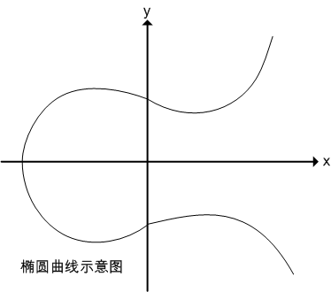
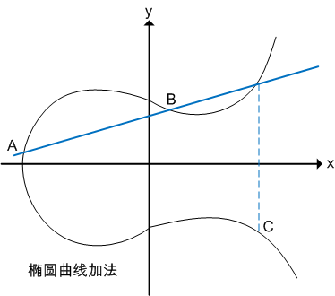
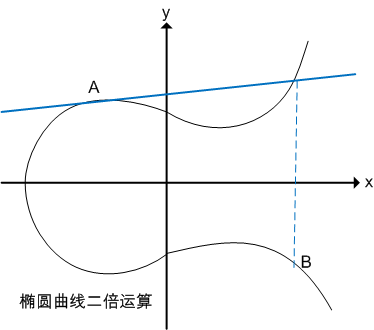
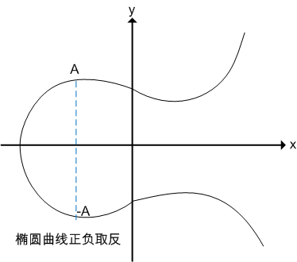
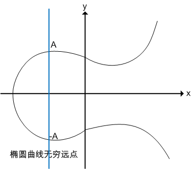
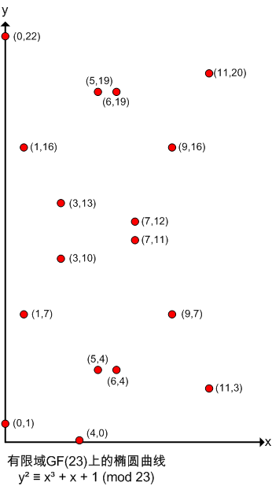
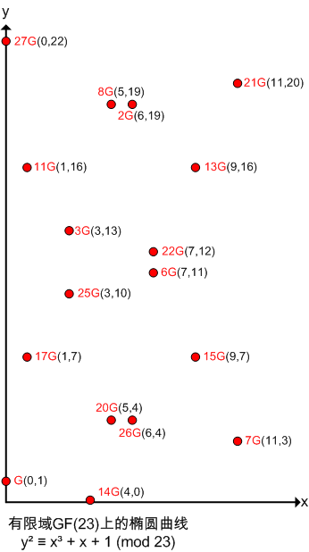

# 椭圆曲线加解密及签名算法的技术原理及其Go语言实现

椭圆曲线加密算法，即：Elliptic Curve Cryptography，简称ECC，是基于椭圆曲线数学理论实现的一种非对称加密算法。
相比RSA，ECC优势是可以使用更短的密钥，来实现与RSA相当或更高的安全。
据研究，160位ECC加密安全性相当于1024位RSA加密，210位ECC加密安全性相当于2048位RSA加密。

椭圆曲线在密码学中的使用，是1985年由Neal Koblitz和Victor Miller分别独立提出的。

### 椭圆曲线

一般，椭圆曲线可以用如下二元三阶方程表示：
y² = x³ + ax + b，其中a、b为系数。

如果满足条件4a³+27b²≠0，则可以基于E(a, b)定义一个群。

其形状如下：



### 定义椭圆曲线的运算规则

椭圆曲线上的运算规则，由如下方式定义：

加法：过曲线上的两点A、B画一条直线，找到直线与椭圆曲线的交点，交点关于x轴对称位置的点，定义为A+B，即为加法。
如下图所示：

A + B = C



二倍运算：上述方法无法解释A + A，即两点重合的情况。
因此在这种情况下，将椭圆曲线在A点的切线，与椭圆曲线的交点，交点关于x轴对称位置的点，定义为A + A，即2A，即为二倍运算。
如下图所示：

A + A = 2A = B



正负取反：将A关于x轴对称位置的点定义为-A，即椭圆曲线的正负取反运算。
如下图所示：



无穷远点：如果将A与-A相加，过A与-A的直线平行于y轴，可以认为直线与椭圆曲线相交于无穷远点。
如下图所示：



综上，定义了A+B、2A运算，因此给定椭圆曲线的某一点G，可以求出2G、3G（即G + 2G）、4G......。
即：当给定G点时，已知x，求xG点并不困难。反之，已知xG点，求x则非常困难。
此即为椭圆曲线加密算法背后的数学原理。

### 有限域上的椭圆曲线运算

椭圆曲线要形成一条光滑的曲线，要求x,y取值均为实数，即实数域上的椭圆曲线。
但椭圆曲线加密算法，并非使用实数域，而是使用有限域。
按数论定义，有限域GF(p)指给定某个质数p，由0、1、2......p-1共p个元素组成的整数集合中定义的加减乘除运算。

假设椭圆曲线为y² = x³ + x + 1，其在有限域GF(23)上时，写作：

y² ≡ x³ + x + 1 (mod 23)

此时，椭圆曲线不再是一条光滑曲线，而是一些不连续的点，如下图所示。
以点(1,7)为例，7² ≡ 1³ + 1 + 1 ≡ 3 (mod 23)。如此还有如下点：

(0,1) (0,22)
(1,7) (1,16)
(3,10) (3,13)
(4,0)
(5,4) (5,19)
(6,4) (6,19)
(7,11) (7,12)
(9,7) (9,16)
(11,3) (11,20)
等等。

另外，如果P(x,y)为椭圆曲线上的点，则-P即(x,-y)也为椭圆曲线上的点。
如点P(0,1)，-P=(0,-1)=(0,22)也为椭圆曲线上的点。



### 计算xG

相关公式如下：
有限域GF(p)上的椭圆曲线y² = x³ + ax + b，若P(Xp, Yp), Q(Xq, Yq)，且P≠-Q，则R(Xr,Yr) = P+Q 由如下规则确定：
* Xr = (λ² - Xp - Xq) mod p
* Yr = (λ(Xp - Xr) - Yp) mod p
* 其中λ = (Yq - Yp)/(Xq - Xp) mod p（若P≠Q）, λ = (3Xp² + a)/2Yp mod p（若P=Q）

因此，有限域GF(23)上的椭圆曲线y² ≡ x³ + x + 1 (mod 23)，假设以(0,1)为G点，计算2G、3G、4G...xG等等，方法如下：

计算2G：
* λ = (3x0² + 1)/2x1 mod 23 = (1/2) mod 23 = 12
* Xr = (12² - 0 - 0) mod 23 = 6
* Yr = (12(0 - 6) - 1) mod 23 = 19
即2G为点(6,19)

计算3G：
3G = G + 2G，即(0,1) + (6,19)
* λ = (19 - 1)/(6 - 0) mod 23 = 3
* Xr = (3² - 0 - 6) mod 23 = 3
* Yr = (3(0 - 3) - 1) mod 23 = 13
即3G为点(3, 13)

同理计算4G、5G...xG，分布如下图：



### 椭圆曲线加解密算法原理

建立基于椭圆曲线的加密机制，需要找到类似RSA质因子分解或其他求离散对数这样的难题。
而椭圆曲线上的已知G和xG求x，是非常困难的，此即为椭圆曲线上的的离散对数问题。
此处x即为私钥，xG即为公钥。

椭圆曲线加密算法原理如下：

设私钥、公钥分别为k、K，即K = kG，其中G为G点。

公钥加密：
选择随机数r，将消息M生成密文C，该密文是一个点对，即：
C = {rG, M+rK}，其中K为公钥

私钥解密：
M + rK - k(rG) = M + r(kG) - k(rG) = M
其中k、K分别为私钥、公钥。

### 椭圆曲线签名算法原理

椭圆曲线签名算法，即ECDSA。

设私钥、公钥分别为k、K，即K = kG，其中G为G点。

私钥签名：
* 1、选择随机数r，计算点rG(x, y)。
* 2、根据随机数r、消息M的哈希h、私钥k，计算s = (h + kx)/r。
* 3、将消息M、和签名{rG, s}发给接收方。

公钥验证签名：
* 1、接收方收到消息M、以及签名{rG=(x,y), s}。
* 2、根据消息求哈希h。
* 3、使用发送方公钥K计算：hG/s + xK/s，并与rG比较，如相等即验签成功。

原理如下：
hG/s + xK/s = hG/s + x(kG)/s = (h+xk)G/s
= r(h+xk)G / (h+kx) = rG

### Go语言中椭圆曲线的实现

椭圆曲线的接口定义：

```go
type Curve interface {
	//获取椭圆曲线参数
	Params() *CurveParams
	//是否在曲线上
	IsOnCurve(x, y *big.Int) bool
	//加法
	Add(x1, y1, x2, y2 *big.Int) (x, y *big.Int)
	//二倍运算
	Double(x1, y1 *big.Int) (x, y *big.Int)
	//k*(Bx,By)
	ScalarMult(x1, y1 *big.Int, k []byte) (x, y *big.Int)
	//k*G, G为基点
	ScalarBaseMult(k []byte) (x, y *big.Int)
}
//代码位置src/crypto/elliptic/elliptic.go
```

椭圆曲线的接口实现：

```go
type CurveParams struct {
	//有限域GF(p)中质数p
	P       *big.Int
	//G点的阶
	//如果存在最小正整数n，使得nG=O∞，则n为G点的阶
	N       *big.Int
	//椭圆曲线方程y²= x³-3x+b中常数b
	B       *big.Int
	//G点(x,y)
	Gx, Gy  *big.Int
	//密钥长度
	BitSize int
	//椭圆曲线名称
	Name    string
}

func (curve *CurveParams) Params() *CurveParams {
	//获取椭圆曲线参数，即curve，代码略
}

func (curve *CurveParams) IsOnCurve(x, y *big.Int) bool {
	//是否在曲线y²=x³-3x+b上，代码略
}

func (curve *CurveParams) Add(x1, y1, x2, y2 *big.Int) (*big.Int, *big.Int) {
	//加法运算，代码略
}

func (curve *CurveParams) Double(x1, y1 *big.Int) (*big.Int, *big.Int) {
	//二倍运算，代码略
}

func (curve *CurveParams) ScalarMult(Bx, By *big.Int, k []byte) (*big.Int, *big.Int) {
	//k*(Bx,By)，代码略
}

func (curve *CurveParams) ScalarBaseMult(k []byte) (*big.Int, *big.Int) {
	//k*G, G为基点，代码略
}
//代码位置src/crypto/elliptic/elliptic.go
```

### Go语言中椭圆曲线签名的实现

Go标准库中实现的椭圆曲线签名原理，与上述理论中基本接近。
相关证明方法已注释在代码中。

```go
//公钥
type PublicKey struct {
	elliptic.Curve
	X, Y *big.Int
}

//私钥
type PrivateKey struct {
	PublicKey //嵌入公钥
	D *big.Int //私钥
}

func Sign(rand io.Reader, priv *PrivateKey, hash []byte) (r, s *big.Int, err error) {
	entropylen := (priv.Curve.Params().BitSize + 7) / 16
	if entropylen > 32 {
		entropylen = 32
	}
	entropy := make([]byte, entropylen)
	_, err = io.ReadFull(rand, entropy)
	if err != nil {
		return
	}

	md := sha512.New()
	md.Write(priv.D.Bytes()) //私钥
	md.Write(entropy)
	md.Write(hash)
	key := md.Sum(nil)[:32]

	block, err := aes.NewCipher(key)
	if err != nil {
		return nil, nil, err
	}

	csprng := cipher.StreamReader{
		R: zeroReader,
		S: cipher.NewCTR(block, []byte(aesIV)),
	}

	c := priv.PublicKey.Curve //椭圆曲线
	N := c.Params().N //G点的阶
	if N.Sign() == 0 {
		return nil, nil, errZeroParam
	}
	var k, kInv *big.Int
	for {
		for {
			//取随机数k
			k, err = randFieldElement(c, csprng)
			if err != nil {
				r = nil
				return
			}

			//求k在有限域GF(P)的逆，即1/k
			if in, ok := priv.Curve.(invertible); ok {
				kInv = in.Inverse(k)
			} else {
				kInv = fermatInverse(k, N) // N != 0
			}

			//求r = kG
			r, _ = priv.Curve.ScalarBaseMult(k.Bytes())
			r.Mod(r, N)
			if r.Sign() != 0 {
				break
			}
		}

		e := hashToInt(hash, c) //e即哈希
		s = new(big.Int).Mul(priv.D, r) //Dr，即DkG
		s.Add(s, e) //e+DkG
		s.Mul(s, kInv) //(e+DkG)/k
		s.Mod(s, N) // N != 0
		if s.Sign() != 0 {
			break
		}
		
		//签名为{r, s}，即{kG, (e+DkG)/k}
	}

	return
}

//验证签名
func Verify(pub *PublicKey, hash []byte, r, s *big.Int) bool {
	c := pub.Curve //椭圆曲线
	N := c.Params().N //G点的阶

	if r.Sign() <= 0 || s.Sign() <= 0 {
		return false
	}
	if r.Cmp(N) >= 0 || s.Cmp(N) >= 0 {
		return false
	}
	e := hashToInt(hash, c) //e即哈希

	var w *big.Int
	//求s在有限域GF(P)的逆，即1/s
	if in, ok := c.(invertible); ok {
		w = in.Inverse(s)
	} else {
		w = new(big.Int).ModInverse(s, N)
	}

	u1 := e.Mul(e, w) //即e/s
	u1.Mod(u1, N)
	u2 := w.Mul(r, w) //即r/s
	u2.Mod(u2, N)

	var x, y *big.Int
	if opt, ok := c.(combinedMult); ok {
		x, y = opt.CombinedMult(pub.X, pub.Y, u1.Bytes(), u2.Bytes())
	} else {
		x1, y1 := c.ScalarBaseMult(u1.Bytes()) //即eG/s
		x2, y2 := c.ScalarMult(pub.X, pub.Y, u2.Bytes()) //即DGr/s
		//即eG/s + DGr/s = (e + Dr)G/s
		//= (e + Dr)kG / (e + DkG) = (e + Dr)r / (e + Dr) = r
		x, y = c.Add(x1, y1, x2, y2) 
	}

	if x.Sign() == 0 && y.Sign() == 0 {
		return false
	}
	x.Mod(x, N)
	return x.Cmp(r) == 0
}
//代码位置src/crypto/ecdsa/ecdsa.go
```

### 后记

椭圆曲线数字签名算法，因其高安全性，目前已广泛应用在比特币、以太坊、超级账本等区块链项目中。


