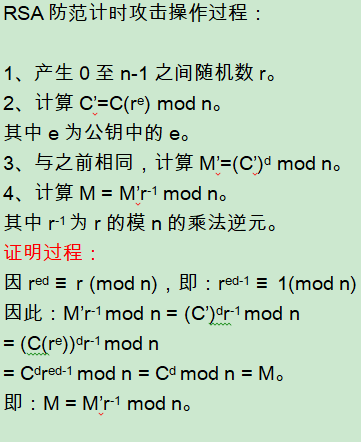

# RSA加解密及签名算法的技术原理及其Go语言实现

对称加密中，加密和解密使用相同的密钥，因此必须向解密者配送密钥，即密钥配送问题。
而非对称加密中，由于加密和解密分别使用公钥和私钥，而公钥是公开的，因此可以规避密钥配送问题。
非对称加密算法，也称公钥加密算法。

1977年，Ron Rivest、Adi Shamir、Leonard Adleman三人在美国公布了一种公钥加密算法，即RSA公钥加密算法。
RSA是目前最有影响力和最常用的公钥加密算法，可以说是公钥加密算法的事实标准。

### RSA加密原理

使用M和C分别表示明文和密文，则RSA加密、解密过程如下：


其中e、n的组合(e, n)即为公钥，d、n的组合(d, n)即为私钥。
当然e、d、n并非任意取值，需要符合一定条件，如下即为e、d、n的求解过程。

### 生成密钥对

e、d、n的求解过程，也即生成密钥对的过程。涉及如下步骤：
* 1、取两个大质数（也称素数）p、q，n = pq。
* 2、取正整数e、d，使得ed mod (p-1)(q-1) = 1，也即：ed ≡ 1 mod (p-1)(q-1)。
e和d是模(p-1)(q-1)的乘法逆元，仅当e与(p-1)(q-1)互质时，存在d。

举例验证：

* 1、取p、q分别为13、17，n = pq = 221。
* 2、而(p-1)(q-1) = 12x16 = 192，取e、d分别为13、133，有13x133 mod 192 = 1
取明文M = 60，公钥加密、私钥解密，加密和解密过程分别如下：


### RSA加密原理证明过程


### 手动求解密钥对中的d

ed mod (p-1)(q-1) = 1，已知e和(p-1)(q-1)求d，即求e对模(p-1)(q-1)的乘法逆元。
如上面例子中，p、q为13、17，(p-1)(q-1)=192，取e=13，求13d mod 192 = 1中的d。

13d ≡ 1 (mod 192)，在右侧添加192的倍数，使计算结果可以被13整除。
13d ≡ 1 + 192x9 ≡ 13x133 (mod 192)，因此d = 133

其他计算方法有：费马小定律、扩展欧几里得算法、欧拉定理。

### RSA安全性

由于公钥公开，即e、n公开。
因此破解RSA私钥，即为已知e、n情况下求d。
因ed mod (p-1)(q-1) = 1，且n=pq，因此该问题演变为：对n质因数分解求p、q。

目前已被证明，已知e、n求d和对n质因数分解求p、q两者是等价的。
实际中n长度为2048位以上，而当n>200位时分解n是非常困难的，因此RSA算法目前仍被认为是安全实用的。

### RSA计时攻击和防范

RSA解密的本质是模幂运算，即：


其中C为密文，(d,n)为私钥，均为超过1024位的大数运算，直接计算并不可行，因此最经典的算法为蒙哥马利算法。
而这种计算是比较是耗时的，因此攻击者可以观察不同的输入对应的解密时间，通过分析推断私钥，称为计时攻击。
而防范RSA计时攻击的办法，即在解密时加入随机因素，使得攻击者无法准确获取解密时间。

具体实现步骤如下：



### go标准库中的RSA加解密实现

go标准库中解密即实现了对计时攻击的防范，代码如下：

```go
//加密
//m为明文
//(pub.E, pub.N)为公钥
//c为密文
func encrypt(c *big.Int, pub *PublicKey, m *big.Int) *big.Int {
	e := big.NewInt(int64(pub.E))
	c.Exp(m, e, pub.N)
	return c
}

//解密
//传入random支持防范计时攻击
func decrypt(random io.Reader, priv *PrivateKey, c *big.Int) (m *big.Int, err error) {
	if c.Cmp(priv.N) > 0 {
		err = ErrDecryption
		return
	}
	if priv.N.Sign() == 0 {
		return nil, ErrDecryption
	}

	var ir *big.Int
	if random != nil {
		var r *big.Int

		for {
			//步骤1产生0至n-1之间随机数r
			r, err = rand.Int(random, priv.N)
			if err != nil {
				return
			}
			if r.Cmp(bigZero) == 0 {
				r = bigOne
			}
			var ok bool
			//r的模n的乘法逆元ir，步骤4中使用
			ir, ok = modInverse(r, priv.N)
			if ok {
				break
			}
		}
		bigE := big.NewInt(int64(priv.E))
		//计算步骤2中C'
		rpowe := new(big.Int).Exp(r, bigE, priv.N) // N != 0
		cCopy := new(big.Int).Set(c)
		cCopy.Mul(cCopy, rpowe)
		cCopy.Mod(cCopy, priv.N)
		c = cCopy
	}

	if priv.Precomputed.Dp == nil {
		//步骤3，使用C'计算对应的M'
		m = new(big.Int).Exp(c, priv.D, priv.N)
	} else {
		//略
	}

	if ir != nil {
		//步骤4计算实际的M
		m.Mul(m, ir)
		m.Mod(m, priv.N)
	}

	return
}
//代码位置src/crypto/rsa/rsa.go
```

### RSA签名和验签的原理

非对称加密算法，除支持加密外，还可以实现签名。原理如下：

签名：
* 1、提取消息摘要，使用发送方私钥对消息摘要加密，生成消息签名。
* 2、将消息签名和消息一起，使用接收方公钥加密，获得密文。

验签：
* 1、使用接收方私钥对密文解密，获得消息和消息签名。
* 2、使用发送方公钥解密消息签名，获得消息摘要。
* 3、使用相同办法重新提取消息摘要，与上一步中消息摘要对比，如相同则验签成功。

附示意图如下：


### go标准库中的RSA签名和验签实现

代码如下：

```go
//签名
func SignPKCS1v15(rand io.Reader, priv *PrivateKey, hash crypto.Hash, hashed []byte) ([]byte, error) {
	//哈希提取消息摘要
	hashLen, prefix, err := pkcs1v15HashInfo(hash, len(hashed))
	if err != nil {
		return nil, err
	}

	tLen := len(prefix) + hashLen
	k := (priv.N.BitLen() + 7) / 8
	if k < tLen+11 {
		return nil, ErrMessageTooLong
	}

	// EM = 0x00 || 0x01 || PS || 0x00 || T
	em := make([]byte, k)
	em[1] = 1
	for i := 2; i < k-tLen-1; i++ {
		em[i] = 0xff
	}
	//整合消息摘要和消息体
	copy(em[k-tLen:k-hashLen], prefix)
	copy(em[k-hashLen:k], hashed)

	m := new(big.Int).SetBytes(em)
	//使用发送方私钥加密消息摘要和消息体，即为签名
	c, err := decryptAndCheck(rand, priv, m)
	if err != nil {
		return nil, err
	}

	copyWithLeftPad(em, c.Bytes())
	return em, nil
}

//验证签名
func VerifyPKCS1v15(pub *PublicKey, hash crypto.Hash, hashed []byte, sig []byte) error {
	//哈希提取消息摘要
	hashLen, prefix, err := pkcs1v15HashInfo(hash, len(hashed))
	if err != nil {
		return err
	}

	tLen := len(prefix) + hashLen
	k := (pub.N.BitLen() + 7) / 8
	if k < tLen+11 {
		return ErrVerification
	}

	c := new(big.Int).SetBytes(sig)
	//使用发送方公钥解密，提取消息体和消息签名
	m := encrypt(new(big.Int), pub, c)
	em := leftPad(m.Bytes(), k)
	// EM = 0x00 || 0x01 || PS || 0x00 || T

	//对比发送方和接收方消息体、以及消息签名
	ok := subtle.ConstantTimeByteEq(em[0], 0)
	ok &= subtle.ConstantTimeByteEq(em[1], 1)
	ok &= subtle.ConstantTimeCompare(em[k-hashLen:k], hashed)
	ok &= subtle.ConstantTimeCompare(em[k-tLen:k-hashLen], prefix)
	ok &= subtle.ConstantTimeByteEq(em[k-tLen-1], 0)

	for i := 2; i < k-tLen-1; i++ {
		ok &= subtle.ConstantTimeByteEq(em[i], 0xff)
	}

	if ok != 1 {
		return ErrVerification
	}

	return nil
}
//代码位置src/crypto/rsa/pkcs1v15.go
```

### 后记

RSA算法中使用了大量数论知识，有关数论知识还有待学习。
待续。


