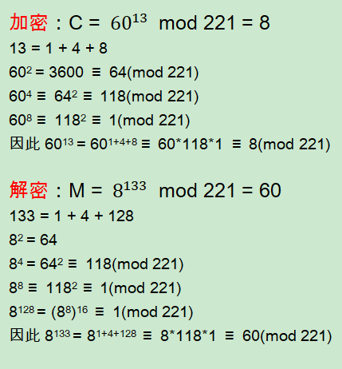

# RSA加解密及签名算法的技术原理

对称加密中，加密和解密使用相同的密钥，因此必须向解密者配送密钥，即密钥配送问题。
而非对称加密中，由于加密和解密分别使用公钥和私钥，而公钥是公开的，因此可以规避密钥配送问题。
非对称加密算法，也称公钥加密算法。

1977年，Ron Rivest、Adi Shamir、Leonard Adleman三人在美国公布了一种公钥加密算法，即RSA公钥加密算法。
RSA是目前最有影响力和最常用的公钥加密算法，RSA可以说是公钥加密算法的事实标准。

### RSA加密原理

使用M和C分别表示明文和密文，则RSA加密、解密过程如下：

其中e、n的组合(e, n)即为公钥，d、n的组合(d, n)即为私钥。
当然e、d、n并非任意取值，需要符合一定条件，如下即为e、d、n的求解过程。

### 生成密钥对

e、d、n的求解过程，也即生成密钥对的过程。涉及如下步骤：
* 1、取两个大质数（也称素数）p、q，n = pq。
* 2、取正整数e、d，使得ed mod (p-1)(q-1) = 1，也即：ed ≡ 1 mod (p-1)(q-1)。
e和d是模(p-1)(q-1)的乘法逆元，仅当e与(p-1)(q-1)互质时，存在d。

举例验证：

* 1、取p、q分别为13、17，n = pq = 221。
* 2、而(p-1)(q-1) = 12*16 = 192，取e、d分别为13、133，有13*133 mod 192 = 1
取明文M = 60，公钥加密、私钥解密，加密和解密过程分别如下：

### RSA加密原理证明过程

### RSA安全性

由于公钥公开，即e、n公开。
因此破解RSA私钥，即为已知e、n情况下求d。
因ed mod (p-1)(q-1) = 1，且n=pq，因此该问题演变为：对n质因数分解求p、q。

目前已被证明，已知e、n求d和对n质因数分解求p、q两者是等价的。
实际中n长度为2048位以上，而当n>200位时分解n是非常困难的，因此RSA算法目前仍被认为是安全实用的。

### 手动求解密钥对中的d

ed mod (p-1)(q-1) = 1，已知e和(p-1)(q-1)求d，即求e对模(p-1)(q-1)的乘法逆元。
如上面例子中，p、q为13、17，(p-1)(q-1)=192，取e=13，求13d mod 192 = 1中的d。

13d ≡ 1 (mod 192)，在右侧添加192的倍数，使计算结果可以被13整除。
13d ≡ 1 + 192*9 ≡ 13*133 (mod 192)，因此d = 133

其他计算方法有：费马小定律、扩展欧几里得算法、欧拉定理。

### RSA签名和验签的原理

非对称加密算法，除支持加密外，还可以实现签名。原理如下：

签名：
* 1、提取消息摘要，使用发送方私钥对消息摘要加密，生成消息签名。
* 2、将消息签名和消息一起，使用接收方公钥加密，获得密文。

验签：
* 1、使用接收方私钥对密文解密，获得消息和消息签名。
* 2、使用发送方公钥解密消息签名，获得消息摘要。
* 3、使用相同办法重新提取消息摘要，与上一步中消息摘要对比，如相同则验签成功。

附示意图如下：

### 后记

待续。

